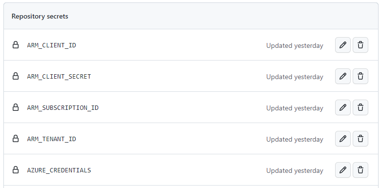

# Demo Automation
In this repository, you will find source code to build a container-based application hosted on Microsoft Azure cloud. This PoC will deliver a web app hosting solution leveraging Azure Container App, and Docker containers on Linux nodes.

In order to deploy the infrastructure and the container-based application, we use DevOps practices thanks to GitHub actions and automation.

# Architecture
The application used for this demo is composed of a frontend Blazor App, a backend Web Api and a backend-for-frontend proxy, developed in Microsoft .Net C#. This is a simplified version of a more complex micro-services application, helping us to focus on resource organisation and deployment automation.

The application uses Azure Active Directory for user authentication folowing the instruction in the [Secure an ASP.NET Core Blazor WebAssembly standalone app with Azure Active Directory](https://learn.microsoft.com/en-us/aspnet/core/blazor/security/webassembly/standalone-with-azure-active-directory?view=aspnetcore-6.0) topic.

The following schema illustrates the architecture used in this demo.

In order to avoid exposing all infrastructure resources on internet, we choose to deploy all resources privatly within a private virtual network. As we use Azure PaaS resources, this can be achieved by using [Azure Private Endpoints](https://learn.microsoft.com/en-us/azure/private-link/private-endpoint-overview). To support our private deployment scenario, we will rely on [Azure Private DNS Zones](https://learn.microsoft.com/en-us/azure/private-link/private-endpoint-dns) to help us performing DNS resolution inside of our network.

To continue to focus on security best practices, we will rely on [managed identities](https://learn.microsoft.com/en-us/azure/active-directory/managed-identities-azure-resources/overview) when possible. As example, Azure Managed Identity is used to connect to the SQL Database in order to avoid having to managed a password provided within the connection string. In contrario, we can't rely on this managed identity to connect to Redis Cache.

Then, an Azure Front Door, deployed in front of our services, enables us to expose publicly our application endpoint, controlled with a WAF policy. More information about integrating Azure Front Door WAF with Azure Container Apps is available [here](https://techcommunity.microsoft.com/t5/fasttrack-for-azure/integrating-azure-front-door-waf-with-azure-container-apps/ba-p/3729081).

# Software architecture
Our software architecture is based on a request routing in Backend for Frontend (BFF) scenarios. This means that we built a reverse proxy used to re-route requests from frontend application via BFF to destination API endpoint. BFF layer is protected with cookie based authentication so "No tokens in browser" can be applied. Basically reverse proxy functionality of BFF layer extracts access token from the cookie and passes it further to destination API endpoint. The reverse proxy is implemented using [YARP](https://microsoft.github.io/reverse-proxy/) middleware, which gives us the flexibility to implement custom middlewares and to centralize the authentication requirements of our application.
This architecture is based on the blog [How to implement request routing for BFF with YARP](https://www.kallemarjokorpi.fi/blog/request-routing-in-bff.html).

The following schema illustrates the communication flow between the frontend client (running in the browser), the reverse proxy and the backend API.

Note that, even if this architecture is supported with most of Identity Provider, the "on-behalf-of" pattern used here is unfortunately not supported with Azure Active Directory B2C. Indeed, as explains in the [Microsoft documentation](https://learn.microsoft.com/en-us/azure/active-directory-b2c/access-tokens), <i>Web API chains (On-Behalf-Of) is not supported by Azure AD B2C</i>.

In this code sample, The refresh token is used to get an access token targeting the backend API. This is working fine except in scenario where you want to rely on app roles. This scenario is not supported by Azure AD B2C, as the app roles are not returned in the access token.

# Azure Resource organisation
Organizing effectively your Azure resources is part of the [ready stage](https://learn.microsoft.com/en-us/azure/cloud-adoption-framework/ready/azure-setup-guide/organize-resources) of the Cloud Adoption Framework. This helps to secure, manage, and track costs that are related to your workloads.

Within this project, resources are organized inside a single subscription, divided in resource groups, as illustrated in the diagram below. This resource organisation simulates the splits of responsibilities where
* The DevOps team manages deployment automation practices and tooling, such as 
    * A central infrastructure state repository that must be immutable outside of any deployment and protected from any deletion.
    * Self-hosted runners that are used to support the software factory toolings.
* The Infrastructure and network teams manage the central and shared services used by many different cloud workloads.
* The application development team manages its own application specific resources.

Note: This resource organisation choosen in this project is subject to be updated accordingly to your practices and organisation, and this is not an illustration of a real case scenario.

# Getting Started
Follow the steps described in this section in order to setup your environment enabling you to start deploying the application and apply some changes in order to see your changes deployed automatically using GitHub Actions.

## Azure Applications Registrations
As we have two services that perform user authorization based on a token emitted by the Azure Active Directory, we need to register these services as application in Azure App Registrations. One of these applications (Backend for Frontend) uses the [OAuth 2.0 on behalf-of flow](https://learn.microsoft.com/en-us/azure/active-directory/develop/v2-oauth2-on-behalf-of-flow) to authenticate requests to the downstream API Endpoint, so we need to generate a secret for this application.

These applications are registered through [code](IaC/app-registrations/) using AZ CLI. Update the script [main.ps1](IaC/app-registrations/main.ps1) and ensure to copy the returned values and store them as repository variables and secrets (in my case APP_REGISTRATION_CLIENTID_FOR_API, APP_REGISTRATION_CLIENTID_FOR_BFF and APP_REGISTRATION_SECRET_FOR_BFF). You will use these information when deploying your container infrastructure using GitHub Actions.

## Azure credentials for GitHub Actions
In order to run your GitHub actions authenticated with an Azure service principal, you must create this service principal using the following commands.

Login into your Azure tenant:

    az login --tenant <YOUR-TENANT-ID>
    az account set --subscription <YOUR-SUBSCRIPTION-ID>

Create then the service principal using `create-for-rbac` command helping you to grant access to the relevant scope for your deployment. Here, we choose to grant the owner role to the subscription where we will deploy our application. In a real case scenario, always consider the least-privilege principal in your role assignment, as owner gives all permissions to your scope and might be too permissive.

    $appName = "GitHub-Action-Deploy"
    
    az ad sp create-for-rbac `
        --name $appName `
        --role Owner `
        --scope "/subscriptions/<YOUR-SUBSCRIPTION-ID>" `
        --sdk-auth

Then, using the output results, create the following JSON object and add this as a GitHub Secret called AZURE_CREDENTIALS. You will use it when executing an `az login` inside your GitHub Actions.

    {
        "clientId": "<GUID>",
        "clientSecret": "<PrincipalSecret>",
        "subscriptionId": "<GUID>",
        "tenantId": "<GUID>"
    }

In order to use this identity with terraform backend, create one secret for clientId, one for clientSecret and so on, as illustrated in the image below. This will enable you to create environment variables with same name to authenticate your terraform backend configuration.

## Terraform state Azure Storage
As the whole environment is deployed using [Terraform on Azure](https://learn.microsoft.com/en-us/azure/developer/terraform/overview) scripts, the first step is to provision an Azure Storage Account enabling to store the state file.

The following AZ CLI script helps you to create this storage in your subscription. Please note that this storage is created with `allow-shared-key-access=true` as this seems to be a limitation with Terraform ignoring the attribute `storage_use_azuread` as mentioned in this [discussion thread](https://github.com/hashicorp/terraform/issues/20831).

    $resourceGroupName = '<YOUR-RESOURCE-GROUP-NAME>'
    $location = '<STORAGE-LOCATION>'
    $storageAccountName = '<YOUR-STORAGE-NAME>'

    # Create terraform resource group
    az group create --name $resourceGroupName --location $location

    # Create terraform storage account
    $storageId = $(az storage account create `
                    --name $storageAccountName --resource-group $resourceGroupName --location $location `
                    --access-tier hot --kind "StorageV2" --sku "Standard_LRS" --https-only `
                    --allow-blob-public-access false --allow-cross-tenant-replication false `
                    --allow-shared-key-access true  --min-tls-version "TLS1_2" `
                    --tags "context=terraform-state" `
                    --output tsv --query id)
    
    # Add container for terraform state file
    az storage container create `
        --name "tfstate" `
        --account-name $storageAccountName `
        --resource-group $resourceGroupName `
        --auth-mode key

    $appName = "GitHub-Action-Deploy"
    $sp=$(az ad sp list --display-name $appName --query [0].id -o tsv)
    az role assignment create `
        --role "Storage Blob Data Contributor" `
        --assignee-object-id $sp `
        --assignee-principal-type ServicePrincipal `
        --scope $storageId

## Landing zone
This step consists in creating the landing zone containing all services already prepared to deploy application specific workload. In general, this step is provisioned by the administration team following enterprise governance, network and security.

For our demo, the landing zone looks like this, illustrated in the following schema.

It consists of
- An enterprise private virtual network where two subnets are dedicated to the application workload
- Monitoring services for platform logs (Log Analytics Workspace) and application logs (Application Insights)
- A secret management service (Key Vault)
- An dedicated Azure Container App Environment to host all of our container images
- An Azure Front Door with an origin configured to target our Azure Container App Environment

This infrastructure is pre-provisioned through [code](IaC/landing-zone/) using Terraform. You can automate the deployment using the [GitHub Action](.github/workflows/landing-zone.yml).
More information on how to deploy this infrastructure is available [here](IaC/README.md).

## Self-hosted GitHub runner containers with Azure Container Apps
Because all of our landing zone services are not publicly available, we need to deploy a self-hosted GitHub runner inside of our private virtual network, giving GitHub access to all of our infrastructure and services.

A self-hosted Github runner might be deployed within a virtual machine or we can can create a container image (windows or linux) using docker that runs as container in any container service. In our case, we will take benefits of our pre-provisioned Azure Container App Environment to host the GitHub runner as an Azure Container App (ref. [Create a docker based self-hosted GitHub runner linux container](https://dev.to/pwd9000/create-a-docker-based-self-hosted-github-runner-linux-container-48dh)).

The first step is to build the self-hosted GitHub runner. The folder [docker-github-runner](docker-github-runner/) contains the docker image definition, and the image is built using a [GitHub action](.github/workflows/docker-github-runner.yml).

The next step is to create a GitHub Personal Access Token (PAT) to register the runner with. As a best practice, use only short lived PAT tokens and regenerate new tokens when a new version of a runner must be deployed. The minimum permission scopes required on the PAT token to register a self hosted runner are: "repo", "read:org". Store this access token as a secret of your repository within GitHub, enabling to use it in the deployment automation using GitHub actions.

Finally, you can deploy the self-hosted GitHub runner running the Terraform [scripts](IaC/docker-github-runner/). You can also automate the deployment using the [GitHub Action](.github/workflows/docker-github-runner-deploy.yml).

As the Azure Container App hosting the GitHub Runner uses auto-scaling rules based on Azure Storage Queue storage, your pipelines running on this runner must trigger a new container start. The [GitHub action](.github/workflows/keda-scale-test.yml) illustrates how this can be achieved using a first scale out job and scale in when job is terminated.

## Deploy the application and its hosting infrastructure
Now the landing zone is deployed and the self-hosted GitHub runner is configured, we can now manage to deploy our application and its specific infrastructure. This concerns the following services:
* Commodity services:
    * An Azure SQL Database to store application data.
    * An Azure redis cache to store in-memory session data related to our proxy.
* An Azure Container App for each service composing our application.
* The Azure Front Door endpoint exposing publicly our application and routing the trafic to our backend proxy.

This deployment will be managed in two steps:
1. First of all, we will deploy the commodity services, pre-provisioned through [code](Iac/app/) using Terraform. You can automate the deployment using the [GitHub Action](.github/workflows/app-storages.yml).
2. Then, we can deploy each new version of our application services using GitHub Actions (example with the [backend API](.github/workflows/web-api-deploy.yml)) which execute a workflow illustrated with the following schema

# Resources
* How to implement request routing for BFF with YARP
    * https://www.kallemarjokorpi.fi/blog/request-routing-in-bff.html
* Set SQL access to Azure Managed Identity
    * https://stackoverflow.com/questions/65544011/howto-add-db-owner-to-azure-sql-server-database-in-github-action
    * https://dev.to/maxx_don/configure-secret-less-connection-from-app-services-to-azure-sql-via-terraform-2jbg)
* Automate terraform with GitHub Actions
    * https://github.com/marketplace/actions/terraform-plan
* Use KeyVault secrets to create ACA secrets
    * https://github.com/microsoft/azure-container-apps/issues/608